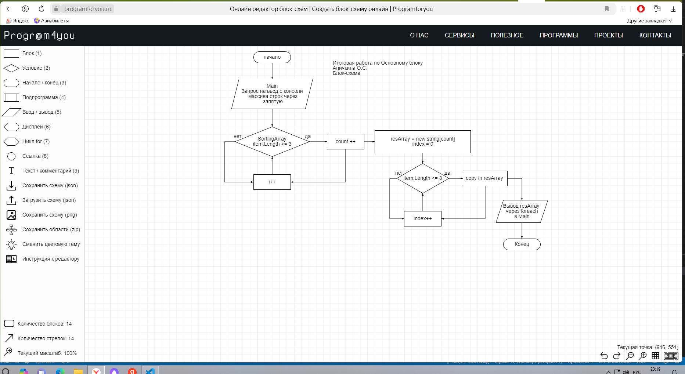

## ФИНАЛЬНАЯ КОНТРОЛЬНАЯ РАБОТА ПО ОСНОВНОМУ БЛОКУ

## Аничкина О.С.

# 1. Создать репозиторий

# 2. Нарисовать блок-схему алгоритма (можно обойтись блок-схемой основной содержательной части, если вы выделяете её в отдельный метод)

